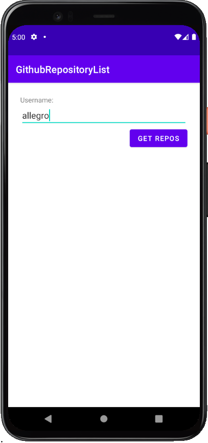
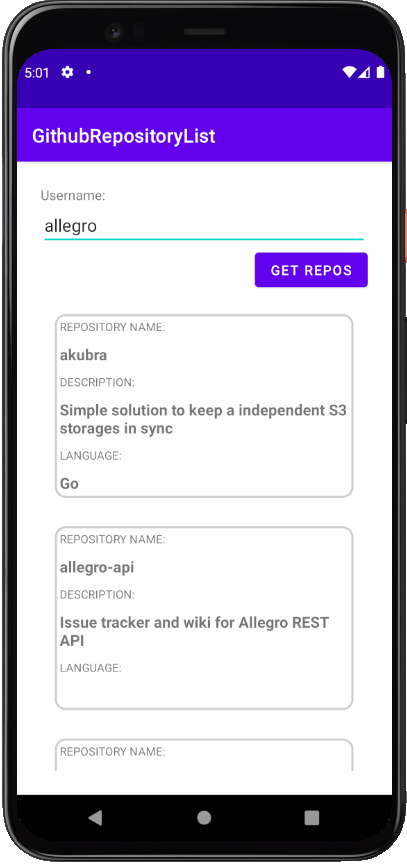
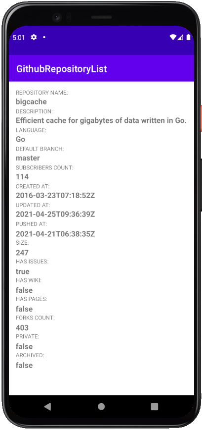

# GitHub-repository-list
The main aim of this application is to fetch data from GitHub API. It was made as a part of Allegro internship  recruitment process.

## Table of contents
* [General info](#general-info)
* [Technologies](#technologies)
* [Setup](#setup)
* [App development](#app_development)
* [Screenshots](#examples)

## General info
This application uses URL to collect data from API.
JSON objects are parsed using Klaxon and presented using RecyclerView.

To fetch data put username in main screen and press 'get repos' button.
To look into repository details press one of shown repository objects on main screen.

The project was made in **April 2021**.

## Technologies
* Kotlin
* Klaxon (JSON parser)
* Android API 30
* Android Studio

## Setup
It`s preferred to open in Android Studio. It shall be launched on **API 30**.
Clone this repository using git bash:
```
https://github.com/bartosztkowalski/GitHub-repository-list.git
```

The app can also be launched using ```Github-repository-list.apk``` file (located in main repository folder)

## App development
There are many ways how we can develop the app:
* more repository details
* more detailed GUI
* use database to develop offline mode
* statistics for every repository branch

## Screenshots


